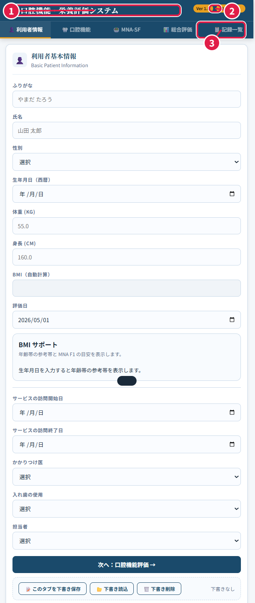
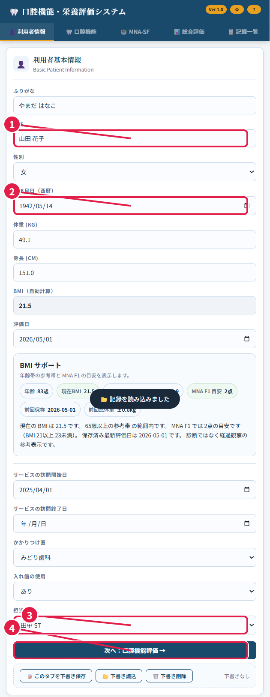
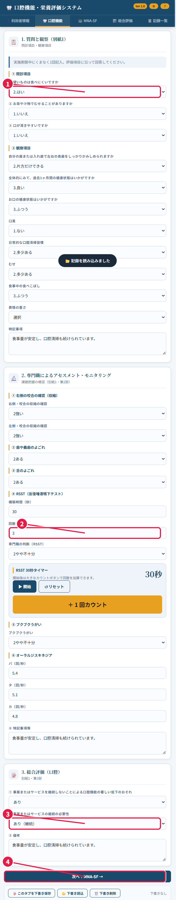
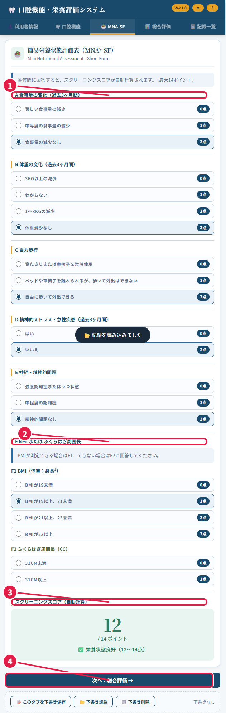
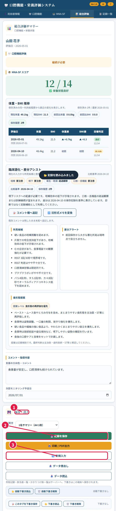
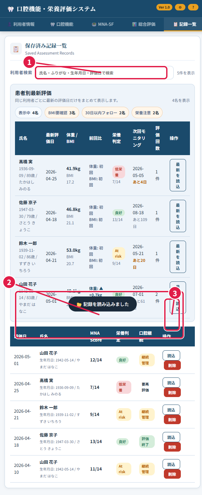
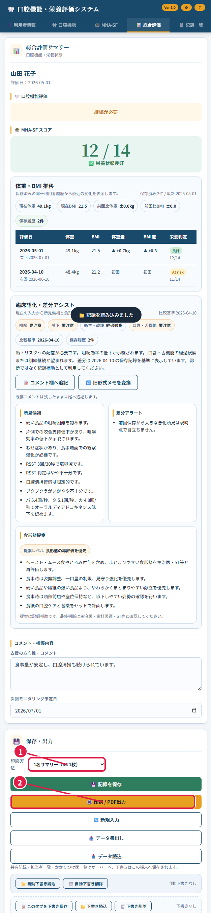
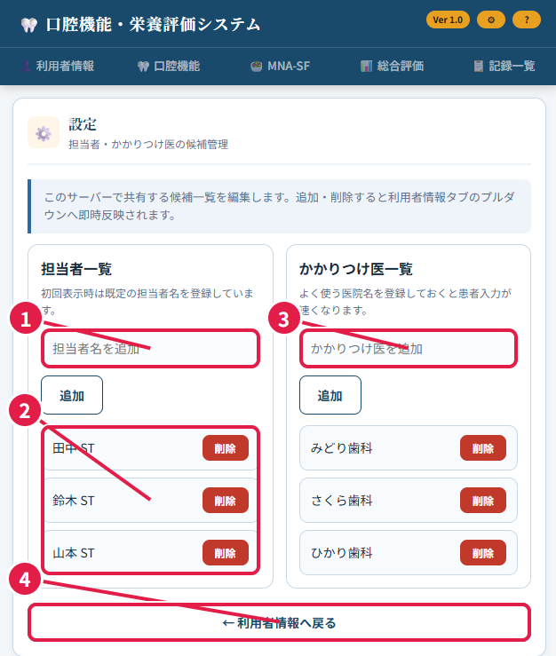

# 初心者向け操作マニュアル

この資料は、PC や Web 操作にあまり慣れていない介護・医療現場スタッフ向けの、やさしい使い方マニュアルです。

このアプリでよく使う流れは、次の 4 つです。

1. Tailscale をつないでアプリを開く
2. 利用者情報、口腔機能、MNA-SF を順番に入れる
3. 保存する
4. あとで記録一覧から検索して読み込む

このアプリは、同じ NAS 上の記録を PC とタブレットで共有して使います。いつも同じ正式 URL を開いてください。

このマニュアルでは、実際の操作画面を使って、どこを押すか、何を入れるか、何に気をつけるかを順番に説明します。

Windows で Tailscale のつなぎ方が分からないときは [TAILSCALE_CLIENT_GUIDE_JA.html](TAILSCALE_CLIENT_GUIDE_JA.html)、タブレットで使うときは [TAILSCALE_TABLET_GUIDE_JA.html](TAILSCALE_TABLET_GUIDE_JA.html) を見てください。

## はじめに

最初に覚えておくことは、次の 3 つだけです。

1. このアプリは、先に Tailscale をつないでから開きます。
2. 利用者は「氏名 + 生年月日」で見分けます。
3. 同じ利用者の同じ評価日は、新しく増えるのではなく上書き更新になります。
4. 記録一覧では、氏名、ふりがな、生年月日、評価日で検索できます。

現在の正式 URL は、管理者から案内された URL を使ってください。今の運用では、通常は https://diskstation.tail632bc4.ts.net/ を開きます。

## 1. アプリを開く / 最初の画面の見方

この章でできること: Tailscale をつないでアプリを開き、最初の画面のどこに何があるか分かります。

1. Tailscale をつなぎます。
何をする画面か: Tailscale の接続を確認する画面です。
どこを押すか: Windows では Tailscale の起動ツール、または Tailscale アプリを開きます。
何を入力するか: 初回だけ、管理者から案内されたアカウントでサインインします。
注意点: Tailscale が未接続のままでは、アプリが開けないことがあります。

2. アプリを開きます。
何をする画面か: ブラウザーで口腔機能・栄養評価システムを開く画面です。
どこを押すか: 起動ツールの「アプリを開く」、またはブラウザーの URL 欄です。
何を入力するか: 必要なら URL を入力します。
注意点: 管理者から案内された URL 以外は開かないでください。

3. 最初の画面を見ます。
何をする画面か: アプリの入口になる画面です。
どこを押すか: 上のタブを押すと、利用者情報、口腔機能、MNA-SF、総合評価、記録一覧へ移動できます。
何を入力するか: この時点ではまだ入力しなくて大丈夫です。
注意点: まずは「利用者情報」から順番に入れると迷いにくいです。

画像の見方:

1. 画面上部にアプリ名が出ます。ここが開いていれば、正しいアプリ画面です。
2. 右上の歯車は設定、? はヘルプです。
3. 上のタブから、入力や検索の画面を切り替えます。

ここだけ覚えれば大丈夫: 先に Tailscale をつなぎ、開いたら上のタブで画面を切り替えます。

## 2. 利用者情報の入力

この章でできること: 利用者の基本情報を入れて、次の口腔機能画面へ進めます。

1. 利用者情報の画面を開きます。
何をする画面か: 氏名、生年月日、担当者などの基本情報を入れる画面です。
どこを押すか: 画面上の「利用者情報」タブです。
何を入力するか: まだ何も入れていないなら、この画面から順番に入れます。
注意点: 最初に開いたときは、この画面が表示されることが多いです。

2. 基本情報を入れます。
何をする画面か: 利用者を正しく見分けるための入力欄です。
どこを押すか: 氏名、生年月日、性別、体重、身長、担当者、かかりつけ医の欄です。
何を入力するか: ふりがな、氏名、生年月日、必要に応じて体重・身長、担当者、かかりつけ医を入れます。
注意点: 生年月日は必ず入れてください。生年月日がないと保存できません。BMI は体重と身長を入れると自動で出ます。

3. 次の画面へ進みます。
何をする画面か: 口腔機能評価へ進むための操作です。
どこを押すか: 「次へ: 口腔機能評価」ボタンです。
何を入力するか: 新しく入力するものはありません。
注意点: 迷ったら、この画面で氏名と生年月日が正しいかをもう一度確認してから進んでください。

画像の見方:

1. 氏名欄です。
2. 生年月日欄です。保存に必要です。
3. 担当者欄です。近くに、かかりつけ医の欄もあります。
4. 入力が終わったら、このボタンで次へ進みます。

ここだけ覚えれば大丈夫: 氏名と生年月日は必須です。迷ったら、この 2 つを先に入れてください。

## 3. 口腔機能評価の入力

この章でできること: 口腔機能の項目を、上から順番に入れられます。

1. 上の質問項目から順番に入れます。
何をする画面か: 問診や観察の結果を入れる画面です。
どこを押すか: 各質問の右にある選択欄です。
何を入力するか: 利用者の状態に合う答えを 1 つずつ選びます。
注意点: 最初から全部を理解しようとせず、上から順番に入れるだけで大丈夫です。

2. 測定や確認の欄を入れます。
何をする画面か: RSST、ブクブクうがい、発音回数などを入れる画面です。
どこを押すか: 数字欄や選択欄です。
何を入力するか: 計測した回数や、観察結果を入れます。
注意点: その場で分からない項目は、測定後に戻って入れてもかまいません。

3. 口腔の総合評価を入れます。
何をする画面か: 継続が必要か、備考を書く欄です。
どこを押すか: 画面の下の方にある総合評価欄です。
何を入力するか: 継続の必要性、必要なら備考を入れます。
注意点: 一番下までスクロールして入力してください。

4. MNA-SF へ進みます。
何をする画面か: 栄養評価へ進む操作です。
どこを押すか: 「次へ: MNA-SF」ボタンです。
何を入力するか: 新しく入力するものはありません。
注意点: この画面は長いので、入力漏れがないか下まで見てから進むと安心です。

画像の見方:

1. まずは上の質問項目から順に答えます。
2. 途中に RSST などの測定欄があります。
3. 画面下の方で、継続の必要性や備考を入れます。
4. 入力後に MNA-SF へ進みます。

ここだけ覚えれば大丈夫: 口腔機能の画面は長いですが、上から順に入れれば大丈夫です。

## 4. MNA-SF の入力

この章でできること: 栄養評価の答えを選び、点数と結果を確認できます。

1. A から E まで答えます。
何をする画面か: 栄養状態を確認する質問画面です。
どこを押すか: それぞれの質問の選択肢です。
何を入力するか: 利用者に合う答えを 1 つずつ選びます。
注意点: 1 問につき 1 つだけ選びます。

2. F を答えます。
何をする画面か: BMI またはふくらはぎ周囲長を使う項目です。
どこを押すか: F1 または F2 の選択肢です。
何を入力するか: 普段は BMI が分かるなら F1 を選びます。BMI が分からないときだけ F2 を使います。
注意点: F1 と F2 を両方入れないようにしてください。

3. 点数と結果を見ます。
何をする画面か: 自動計算された合計点を見る場所です。
どこを押すか: 押す場所はありません。画面下の点数表示を見ます。
何を入力するか: 何も入力しません。
注意点: 途中で答えていない項目があると、結果が正しく出ません。

4. 総合評価へ進みます。
何をする画面か: 保存前の確認画面へ進む操作です。
どこを押すか: 「次へ: 総合評価」ボタンです。
何を入力するか: 新しく入力するものはありません。
注意点: 点数が出ていることを見てから進んでください。

画像の見方:

1. 上から順に答える質問欄です。
2. F は BMI か、ふくらはぎ周囲長のどちらかを使います。
3. ここに合計点と結果が出ます。
4. 終わったら総合評価へ進みます。

ここだけ覚えれば大丈夫: A から F まで全部答えると、点数は自動で出ます。

## 5. 保存のしかた

この章でできること: 入力した内容を保存して、次の新しい入力へ進めます。

1. 総合評価の画面で内容を確認します。
何をする画面か: 口腔機能と MNA-SF の結果をまとめて見る画面です。
どこを押すか: コメント欄や次回モニタリング予定日の欄です。
何を入力するか: 必要ならコメントや予定日を入れます。
注意点: 保存前に、利用者名と評価日が正しいかを見てください。

2. 保存します。
何をする画面か: 記録をサーバーへ保存する操作です。
どこを押すか: 「記録を保存」ボタンです。
何を入力するか: 新しく入力するものはありません。
注意点: 保存が終わる前に画面を閉じないでください。

3. 次の新しい入力へ進むときだけ初期化します。
何をする画面か: 今の入力を空にして、別の利用者を入れる準備をする操作です。
どこを押すか: 「新規入力」ボタンです。
何を入力するか: 新しく入力するものはありません。
注意点: 保存前に押すと、今の入力内容が消えてしまいます。必ず先に保存してください。

画像の見方:

1. 保存と出力をする場所です。
2. まずはこの保存ボタンを押します。
3. 次の利用者を入れるときだけ、新規入力を使います。

ここだけ覚えれば大丈夫: 画面を閉じる前に、必ず「記録を保存」を押してください。

## 6. 記録一覧の使い方

この章でできること: 保存済みの記録を検索して、読み込み直せます。

1. 記録一覧を開きます。
何をする画面か: 保存した記録を探す画面です。
どこを押すか: 上の「記録一覧」タブです。
何を入力するか: まだ入力しません。
注意点: 過去の記録を探すときは、まずこの画面を開きます。

2. 検索します。
何をする画面か: 記録をしぼり込むための検索欄です。
どこを押すか: 一覧の上の検索欄です。
何を入力するか: 氏名、ふりがな、生年月日、評価日のどれかを入れます。
注意点: 一部分だけでも検索できます。

3. 読み込みます。
何をする画面か: 過去の記録を画面へ戻す操作です。
どこを押すか: 「最新を読込」または「読込」ボタンです。
何を入力するか: 新しく入力するものはありません。
注意点: 読み込んだ後に内容を直して保存すると、同じ利用者の同じ評価日は上書き更新になります。

画像の見方:

1. ここで検索します。
2. 読み込みたい利用者の行を見つけます。
3. このボタンで記録を読み込みます。

ここだけ覚えれば大丈夫: 探す、読む、直す、保存する、の順で使います。

## 7. PDF 化

この章でできること: 今、画面に出ている 1 名分の記録を印刷または PDF 化できます。

1. 総合評価の画面を開きます。
何をする画面か: 保存や印刷をする画面です。
どこを押すか: 上の「総合評価」タブです。
何を入力するか: 必要ならコメント欄を調整します。
注意点: 印刷されるのは、今表示している 1 名分だけです。

2. 印刷方法を選びます。
何をする画面か: 1 枚サマリーか、詳細ページかを選ぶ欄です。
どこを押すか: 「印刷方法」の欄です。
何を入力するか: 印刷したい形式を選びます。
注意点: 迷ったら、まずは「1名サマリー（A4 1枚）」で大丈夫です。

3. 印刷 / PDF 出力をします。
何をする画面か: ブラウザーの印刷画面を開く操作です。
どこを押すか: 「印刷 / PDF出力」ボタンです。
何を入力するか: ブラウザーの印刷画面で、必要なら保存先やプリンターを選びます。
注意点: PDF にしたいときは、ブラウザーの印刷先で「PDF に保存」または「Microsoft Print to PDF」を選びます。表示名は PC によって少し違います。

画像の見方:

1. ここで印刷の形式を選びます。
2. このボタンで印刷画面を開きます。

ここだけ覚えれば大丈夫: PDF にするときも、まずは「印刷 / PDF出力」ボタンを押します。

## 8. 設定画面の使い方

この章でできること: 担当者やかかりつけ医の候補を追加・削除できます。

1. 設定を開きます。
何をする画面か: 候補一覧を管理する画面です。
どこを押すか: 右上の歯車です。
何を入力するか: まだ入力しません。
注意点: この画面は主に管理者向けです。

2. 担当者を追加します。
何をする画面か: 担当者一覧を増やす操作です。
どこを押すか: 「担当者名を追加」の欄と「追加」ボタンです。
何を入力するか: 新しく候補に入れたい担当者名です。
注意点: 追加すると、利用者情報画面の担当者プルダウンにすぐ反映されます。

3. かかりつけ医を追加します。
何をする画面か: かかりつけ医一覧を増やす操作です。
どこを押すか: 「かかりつけ医を追加」の欄と「追加」ボタンです。
何を入力するか: 新しく候補に入れたい医院名です。
注意点: ここで入れた候補も、利用者情報画面へすぐ反映されます。

4. 不要な候補を削除し、元の画面へ戻ります。
何をする画面か: 候補整理と画面切り替えの操作です。
どこを押すか: 各候補の「削除」ボタン、または「利用者情報へ戻る」ボタンです。
何を入力するか: 新しく入力するものはありません。
注意点: 削除すると他の端末でも候補が消えるため、操作前に確認してください。

画像の見方:

1. 担当者を追加する欄です。
2. 今登録されている担当者一覧です。
3. かかりつけ医を追加する欄です。
4. 元の入力画面へ戻るボタンです。

ここだけ覚えれば大丈夫: 設定画面で追加・削除した候補は、利用者情報の候補にすぐ反映されます。

## 9. 初心者向けの注意点

この章でできること: つまずきやすいポイントを、先に知って防げます。

1. 生年月日がないと保存できません。
何をする画面か: 利用者情報画面です。
どこを押すか: 生年月日欄です。
何を入力するか: 西暦で生年月日を入れます。
注意点: 氏名だけでは保存できません。

2. 同じ利用者の同じ評価日は、上書き更新になります。
何をする画面か: 保存画面と記録一覧画面に関係するルールです。
どこを押すか: ふだん通り保存ボタンを押します。
何を入力するか: 直したい内容だけ修正します。
注意点: 二重登録ではなく更新になるので、前の内容を残したいときは評価日を変えてください。

3. 別の PC やタブレットでも同じ記録が見えます。
何をする画面か: サーバー共有で使うアプリのための注意です。
どこを押すか: 特別な操作はありません。
何を入力するか: 同じ URL を開きます。
注意点: 同じ URL を開いていないと、別の環境を見ていることがあります。

4. 共用 PC では、作業後にブラウザーを閉じます。
何をする画面か: 操作後の後片付けです。
どこを押すか: ブラウザーの閉じるボタンです。
何を入力するか: 何も入力しません。
注意点: 共用 PC に画面を開いたままにしないでください。

ここだけ覚えれば大丈夫: 生年月日を入れる、保存する、同じ URL を使う。この 3 つで大きな失敗は防げます。

## よくある質問・よくある間違い

### Q1. 「Tailscale 接続が必要です」と出ました

考えられる原因:

1. Tailscale が未接続です。
2. 管理者が案内した URL 以外を開いています。
3. いったん切断された後にブラウザーだけ残っていました。

対処:

1. Tailscale の状態を確認します。
2. もう一度正しい URL を開きます。
3. 分からないときは、管理者へ連絡します。

### Q2. 保存できません

考えられる原因:

1. 生年月日が未入力です。
2. 必要な項目が途中で止まっています。
3. 一時的に通信できていません。

対処:

1. 利用者情報画面へ戻り、生年月日を確認します。
2. もう一度保存ボタンを押します。
3. 直らないときは、管理者へ連絡します。

### Q3. 前に保存した記録が消えたように見えます

考えられる原因:

1. 同じ利用者の同じ評価日で保存したため、上書き更新になっています。

対処:

1. 記録一覧で氏名と評価日を検索します。
2. 履歴として残したいときは、評価日を変えて保存します。

### Q4. 別の端末で記録が見えません

考えられる原因:

1. 片方が別の URL を開いています。
2. 保存が終わる前に画面を閉じました。
3. Tailscale が切れています。

対処:

1. 同じ URL を使っているか確認します。
2. 記録一覧で検索します。
3. Tailscale 接続を確認します。

### Q5. PDF になりません

考えられる原因:

1. ブラウザーの印刷先がプリンターになっています。
2. 印刷画面を閉じただけで保存していません。

対処:

1. 印刷先を「PDF に保存」または「Microsoft Print to PDF」に変えます。
2. 保存先を選んで、最後に保存を押します。

## 最後の短いまとめ

このアプリは、次の順で使えば大丈夫です。

1. Tailscale をつなぐ
2. 利用者情報、口腔機能、MNA-SF を順番に入れる
3. 総合評価画面で保存する
4. あとで必要になったら、記録一覧から検索して読み込む

迷ったときは、まず「生年月日が入っているか」「保存したか」「正しい URL を開いているか」を確認してください。